Jargon Unchained
================

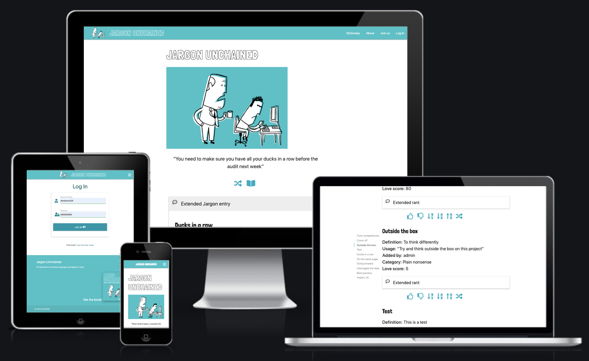


## Introduction

Jargon Unchained 2.0 is the online app version of a business jargon dictionary. It is [deployed on Heroku](https://jargon-unchained.herokuapp.com/).

Jargon Unchained was first published as an entertaining [business jargon e-book](https://leanpub.com/jargonunchained) a seven years ago. The book’s writer and stakeholder “Len Guff” published under pseudonym as even though the book was humorous in tone, its target was the B2B industry in which he worked.

Its intended audience were people, like him, who were perhaps newly-qualifed or fresh from university and were hearing bosses and CEOs employing jargon which sounded smart but was perhaps fundamentally stupid. This said there has been interest from business people who use the jargon but are interested in its correct etymology and correct usage.


## Former strategy

In interview the author claimed his intended growth strategy was to:

1.  Largely give volume 1 away for free and build on a word-of-mouth reputation

2.  Volume 2 would be free in exchange for email or a nominal fee

3.  A growing and interested audience could then be nudged pay more to but volume 3 outright.

Now nearly 8 years after it was conceived the author admits that it has been difficult to maintain momentum and grow Jargon Unchained’s customer base. Also as a largely solo practice of collation, compiling new jargon for future volumes has taken longer than first estimated. The author pointed out that some original words have changed, disappeared or been more broadly adopted. This web app should revitalise interest, ease the burden of compilation and nurture a community who are interested in taking the next ebook further. 

## Competitor research

Many of Jargon Unchained’s competitors are similarly the product of sole-operators.

The stakeholder’s initial research discovered [World Wide Words](http://www.worldwidewords.org/) an archive of newsletter articles and word Index written by a Cambridge graduate and Oxford dictionary reader. He ‘ceased writing’ World Wide Words in 2017. There is no search function and the site is poorly structured.


Larger resources such as [Online Etymology Dictionary](http://www.etymonline.com/) are more robust with larger word lists largely compiled from other printed etmology books. It’s well researched by an American scholar and self-confessed early online amateur. The site's developoer enthusiastically maintains it, even building a Google Chrome extension. There is an academically authoritative layout which is also functional. The search and letter navigation are easy to understand.


A similarly large resource by a British academic Gary Martin is [The Phrase Finder](https://www.phrases.org.uk/). Its scope is even broader but from a UX perspective the home page suffers from feature creep. With a flattened word cloud dominating the right hand side, the alphabet on the left is most useful search. The most interesting homepage function is the 'most popular today’ section.


The full list and well using the well structured taxonomy is the best way to navigate.


Clicking on the ‘Work’ category does take you to around [30 business jargon words](https://www.phrases.org.uk/meanings/business-and-work-related-phrases.html). It’s also worth pointing out that whilst in terms of tonally it’s a much more serious site. Once you’ve stepped through the navigation and reached the database - the UI is clean, fast focussed and learnable.

Much more inline with the humorous tone of Jargon Unchained is[The Business Jargon Dictionary](http://www.theofficelife.com/business-jargon-dictionary-A.html) created by The Office Life. Navigation is via the rounded alphabet old school typwriter letters. It has a moustachioed water-cooler and the brevity of the entries encourages contribution and makes them easily shareable.


Although it’s worth noting that the social share buttons don’t work and the site’s [Twitter account](https://twitter.com/jargondujour) stopped retweeting in 2017. Contribution is done through a contact form which prevents a fluid and active community.

In terms of simple and effective UI nurturing a strong community Jargon Unchained can learn a lot from [Urban Dictionary](https://www.urbandictionary.com/). Its is easy to contribute and interact, from visitors who can upvote and easily contribute, with simple search bar, shuffle function and login, through to a democratic contribution function.


# UX and UI

## UX Priorities

1.  Get people to explore and enjoy the dictionary

2.  Raise awareness of the first ebook

3.  Get people to interact and contribute to the dictionary

4.  Build a community of contributors

5.  Compile new entries into second volume

 

## User Stories


### First Time Visitor Goals

1.  As a First Time Visitor, I want to understand the main purpose and tone of the site.

2.  As a First Time Visitor, I want to find or be surprised and entertained by past entries. I want to easily navigate and search and sort through the dictionary.

3.  As a First Time Visitor, I want to easily interact by up or down voting entries I like. I want it to be fairly frictionless to contribute my own entries.

 

### Returning Visitor Goals

1.  As a Returning Visitor, I want to see that the site is growing and be surprised by new jargon.

2.  As a Returning Visitor, I want to see what entries are doing well.

3.  As a Returning Visitor, I want to write my own contributions and see how they are doing.

4.  As a Returning Visitor, I want to write my own definitions and see how well my previous contributions are doing. 

 

### Frequent User Goals

1.  As a Frequent User, I want to see that the dictionary is growing and help it grow more

2.  As a Frequent User, I want to see what entries are doing well.

3.  As a Frequent User, I want to watch the site grow and get the next volume of the ebook published.

 

## Scope

### Sprint 1: Scope  (1.5 weeks)

1.  Research look and layout the site with the 5 planes of UX (Research, ReadME, Wireframes) 

2.  Planning out work process deadlines, work structure and testing implementation

3.  GitHub’s project Kanban used to track development, improvements and bug fixes.

 

### Sprint 2: Structure (2 weeks)

1.  Code out site structure, repo and basic layout

2.  Structure databases in MongoDB

3.  Add current dictionary, pull through - **Deploy to Heroku**

 

### Sprint 3 Structure / Skeleton

1.  Build user sign up and update pages

2.  Build dictionary, search and sort function.

3.  Build vote up vote down functionality (2nd meeting with mentor)

 

### Sprint 4 Skeleton and Surface

1.  Testing and Bug fixes

2.  Navbar fixing FA icons in place (3rd mentor meeting)

3.  Styling of the site

4.  Final testing

### Sprint 5 (v2)

1. Update ReadMe to include further details on deployement and user journeys and wireframes

2. Add home page (Skeleton and Surface)

3. Add about section

4. Add Jargon dictionary (see [bug #25](https://github.com/dandavies23/jargon-unchained/issues/25))

5. Further bug fixing and testing to [Testing Bugs](readme/TestingBugs.md)

 

## Out of scope

The intention of v1 was to achieve a working Minimal Viable Product (MVP). Energy and time was focussed on creating a database and it being functional from a user perspective. Extra features have been added to this version to enhance the user experience and better fulfil the user journeys. 

 

# Early considerations
## Tone

The site is should be humorous in tone. It should be fun to use and enjoyable to lampoon business jargon. Some of the language used in the field should employ business jargon. Research touchpoints for this are a blend between The Business Jargon Dictionary and Urban Dictionary.

 

## Legacy

Humour is important to how this website is pitched. It is in-sympathy with the original design. As much as is possible, there should be a love/hate relationship with the business jargon. As much as the words or phrases can be annoying it can also be usefuul to play with them.

### Imagery

No photos are used within this project. Illustrations best fit the tone of this project as they are bring out humour. It’s important to emphasise that this is a fun project and a safe place to vent spleen.

## Typography

A font match was made with the title and the [Londrina Outline](https://fonts.google.com/specimen/Londrina+Outline) Google font. But whilst the stretched cover version gave the book cover a touch of class:


The png logo version was difficult to scale down and read. For mobile screens [Londrina Solid](https://fonts.google.com/specimen/Londrina+Solid) was used 

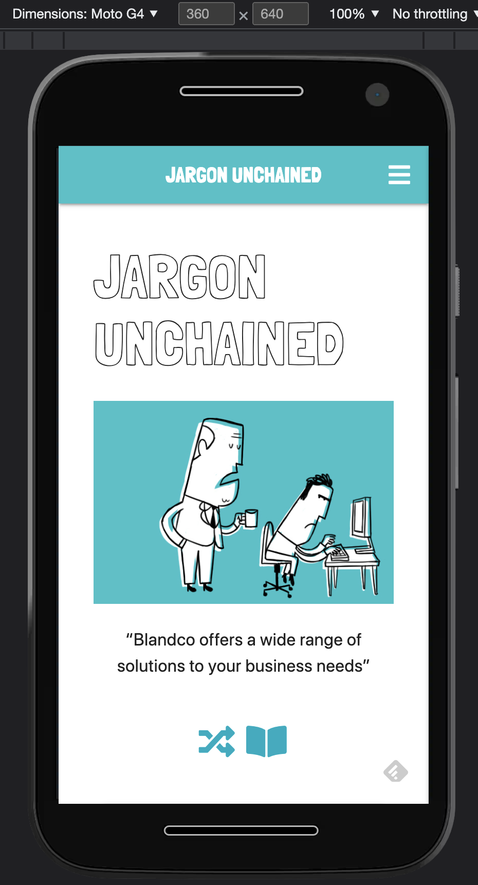

Londrina Solid was a good header font for the dictionary entries. It had a fun and playful character to it and was distinctive break from the entry text. 

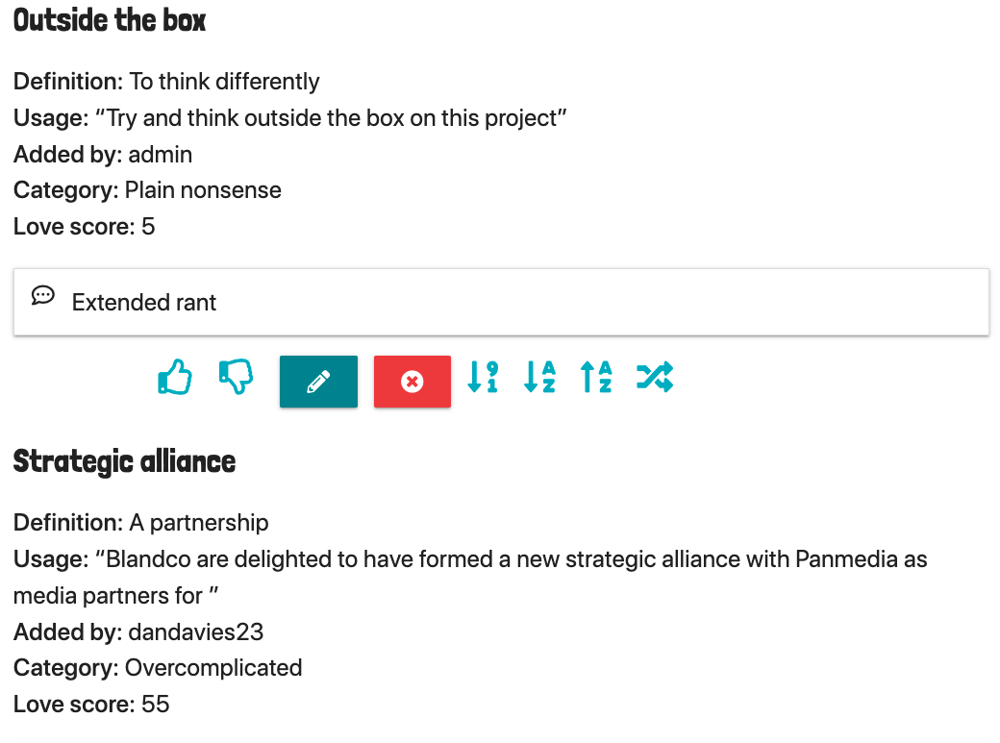

The body text font in the ebook is a fairly standard Helvetica-rooted font. I found the inbuilt Materialise Roboto default to do the job in terms of clarity. I also found Materialize's "[flow-text](https://materializecss.com/typography.html#flow)" made the text clear and readable on all pages across all platforms. 

## Materialize

I thought the [Materialize](https://materializecss.com/) framework was well suited to the project as the dropshadow and other features are a little bit dated now. This became a bit of an issue with the site validation see: [Testing Bugs](readme/TestingBugs.md).


## Wireframes

The initial wireframes were designed in the three main screen sizes - mobile, tablet and desktop. 

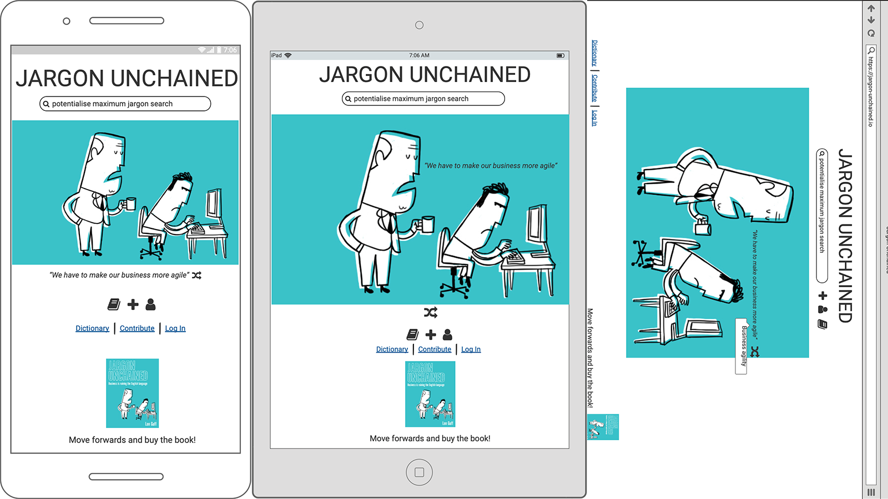

In v1 the homepage was out of scope but in v2 I was able to incorporate this. More detail on this is within the Features section. 

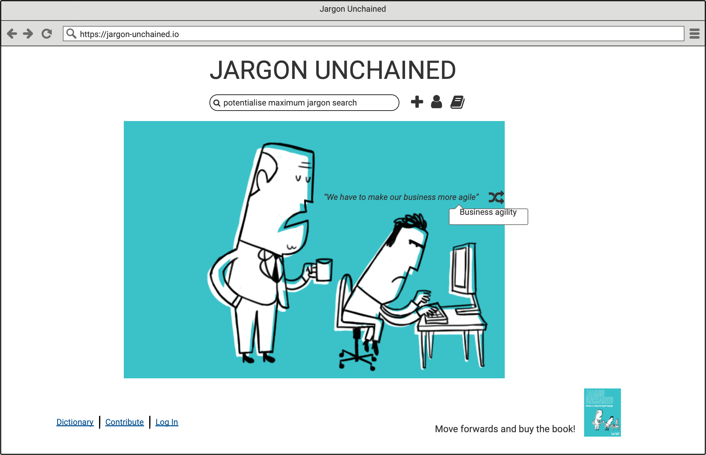

The dictionary section remained largely unchanged. With the icons enabling the sort and filter functions. 

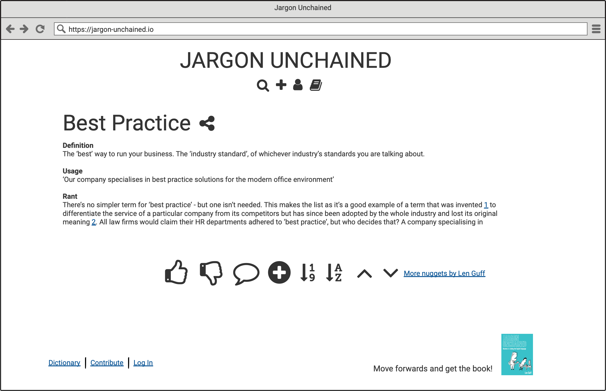


Although I thought it would be better to have the dictionary entries presented within a run. For later versions of the site to allow social sharing of entries I think I will reintroduce a single entry view as a URL. 

My other wireframe considerations can be [accessed here](readme/wireframes) with more explanation why other choices weren't made in Bugs and Fixes.

### Colour Scheme

The navbar and footer use the same "custom-color" as the original ebook cover colour (Cyan #39c2c8). However this had poor contrast on [Coolors](https://coolors.co/contrast-checker/ffffff-39c2c8). 

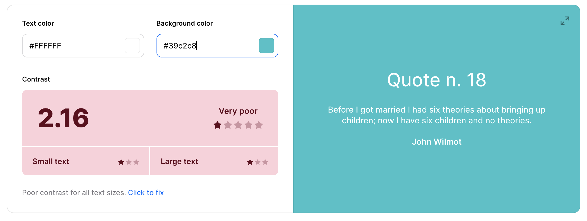

To integrate the illustration the colour was kept in the header only with the navigation moved to a black and white side nav. A complimentary colour with a better score chosen for the footer. And flow-text was used to keep the font as large as possible.

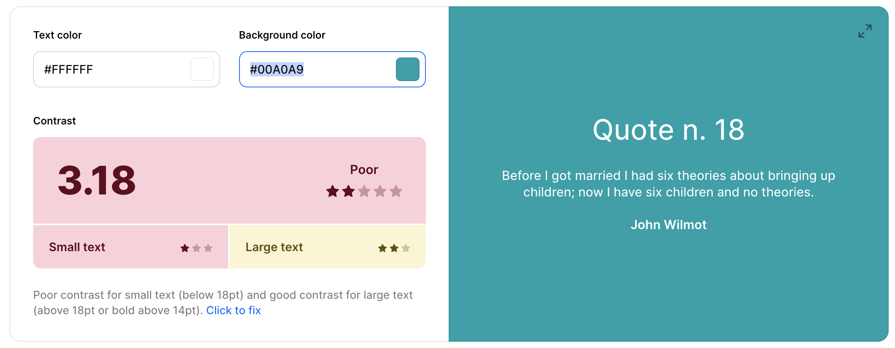


Elsewhere in the site the [Materialize color scale](https://materializecss.com/color.html) darken/lighten is used to offer consistency within an acceptable range. Icons used "cyan-text text-darken-3" which scored well particularly large and unpadded in a button.

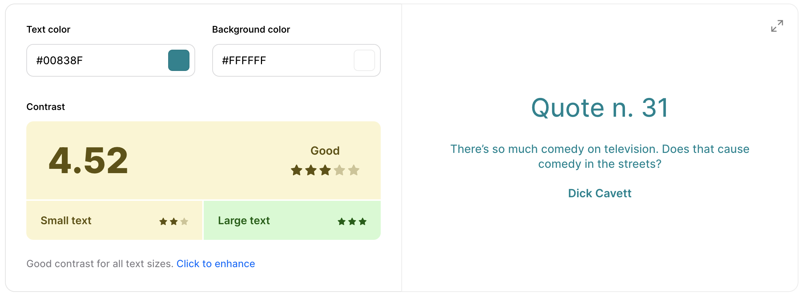

On hover further focus is drawn to the button. 

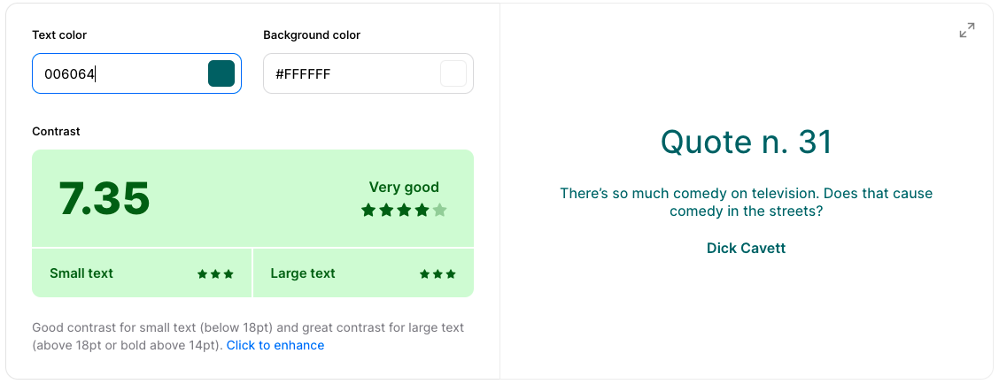

For alerts a black text on "cyan lighten-4" was chosen. 

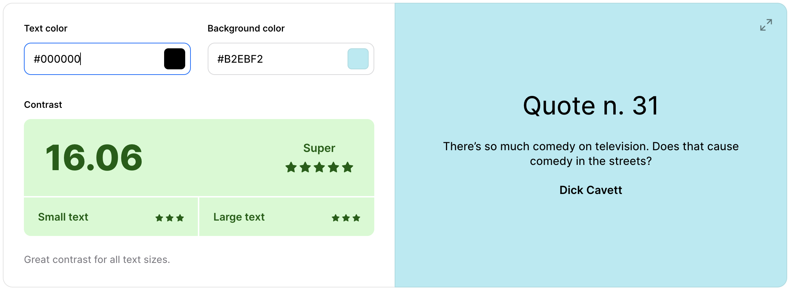

Materialize’s "cyan darken-3" was also used for action icons and "cyan darken-4" for big buttons and "red darken-1" was a striking colour delete warning.
 
# Features

## Adaptive header navbar
- Uses brand colour
- Flexes to all main screen sizes
- Uses 'burger' and solid Londrina in portrait mobile
- Uses ``` &nbsp;``` in header so written header treated as single logo
- Solid Londrina font better readability on Mobile


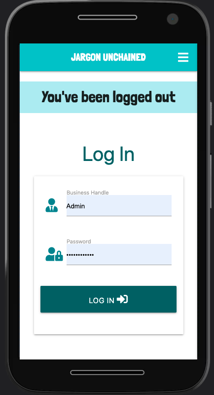

## Flexible footer
- Uses darker colour for better readability
- Visually balanced left and right columns
- Main menu repeat from header, removed from Mobile
- Link to Len Guff leads to About 


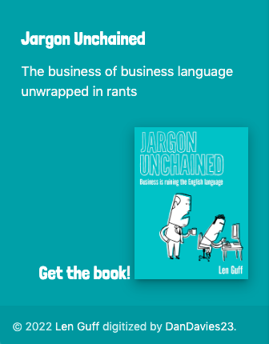

## Homepage splash
- Uses similar header font to e-book cover
- Uses same illustration from book
- Offset quote gives impressioon of 'boss' lecturing his minion (Ken)
- Option to 'shuffle' or find entry in dictionary
- Option to see the entry in context
- "Extended Jargon" entry : on-page single dictionary entry to
- Shuffle and Dictionary buttons explained within rant
- [Thinking that possibly should have entry title?]

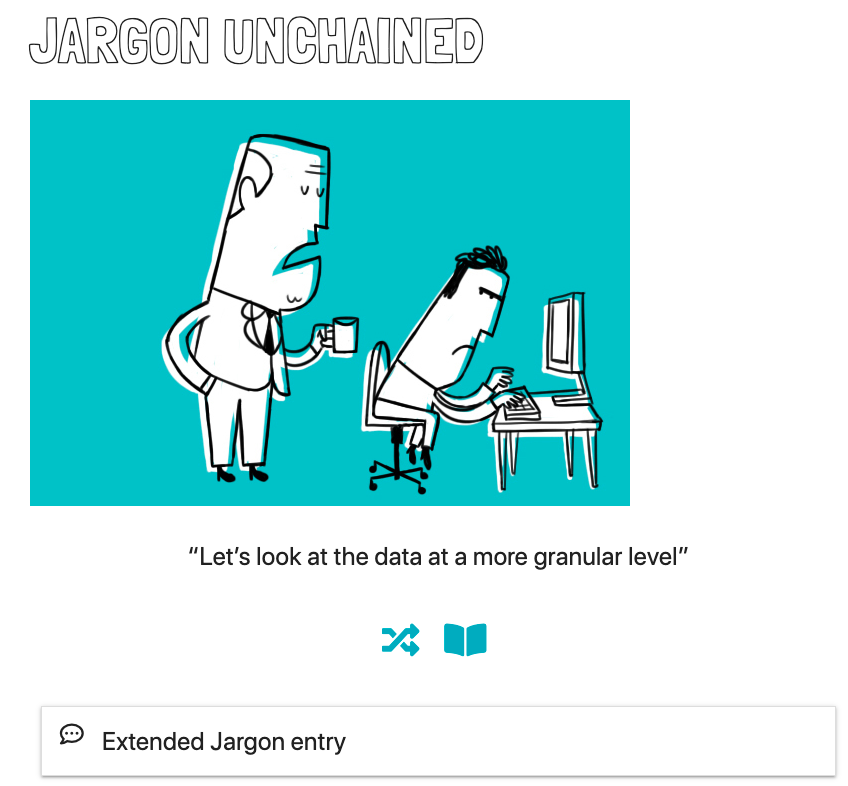

## Search bar
- 'Jargonized' search instruction "Broaden your search envelope"
- List compiled from title, definition and category
- Form validation 
- Search and reset buttons


## Jargon dictionary
- Contextual anchored scrollspy nav based on Jargon list
- Solid Londira header font
- Cleared marked out content and sized text (using Materialises 'flow-text')
- 'Extended rant' collapsible so user can browse entries easier, also 'research' doesn't need to be done straight away and can be done by editor


## Dictionary CTA Bar
- Like or dislike as a visitor to encourage interaction - green on roll-over
- Edit or delete if you are logged in and created the entry / are an admin
- Order list highest score first, A-Z, Z-A or random 10


## Wesbite forms

- CRUD updates to MongoDB
- Friendly font header
- Icon lead
- Instructional form cues
- Validation (including dropdown)

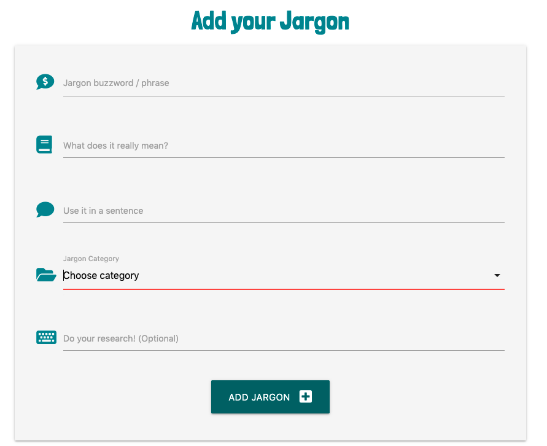

## Profile page
- Easy access to recent entries
- Edit and delete buttons on page


# User Stories Testing

# Databases Collection and workflows
------------------

 

### Category Collection
------------------

*Another way to group entries - added to search function for this Sprint*

Category (category_name): 
- Nouns as verbs

- Tortured metaphors

- Overcomplicated

- Plain nonsense

- -ise

 _Admin can add more categories as they arise_

### Jargon Collection

**Jargon** (jargon_name) (“Jargon" String: max-length:25 required)

**Definition** (definition) “What does it really mean?" String: max-length:200 required)

**Example sentence** (usage) "Use it in a sentence?“ String max-length: 100)

**Optional rant:** (editorialise) "Why is it here? Why do you love and hate it? Can you make it right? Is it going to last?” String: 200 not-required could be editorialised for e-book) END of input field

**Category** (category_name) from category collection

**Love percentage** (love_percent) sets a default of 55 triggered by voting thumbs up / thumbs down. I originally this  be out of 110% but left uncapped for now. Admin can always reset.


### User Collection

**Business Handle** (“name” - chosen by user)

**Password** (“password” - chosen by user)

**E-Deets** (“email” - not for public but could be used for login. _Requires paid for version of MongoDB or another framework_.

**User-level** (determined by Admin)

In discussion with my mentor it was decided for this MVP that email grab wasn’t needed as verification protocol and technology isn’t in place. Further down the line it will be.

### Comment collection (Out of scope)

Requires login to comment. Users are able to debate the correctness of the jargon. And possibly suggest updates or changes. Changes can be made only by the creator of the entry or and editor or higher user.

 

## User types

**Visitor:** can explore the dictionary and vote up and down (Read, Vote)

**User:** able to write contribute their own phrases and definitions, they can also update and delete their own entries. (Read, Vote, Create, Update own records, Delete own records, Comment on others)

_In this current sprint editor is currently frontend 'admin' user and more complex administration is done in MongoDB._

**Editor:** able to check and update and delete other contributions. (Update, Delete other entries _for this sprint Editor is a admin through the JUC GUI_)

**Admin**: able to grant editor user level, rewrite delete other contributions, have final say on definition. (Read, Vote, Create, Update own records, Delete own records, Delete users, compile issue 2 - _for this sprint the Admin would work from the MongoDB GUI to mark entries for compilation_ )

 
## Testing and Bugs
Testing and further details on compenents and features can be [found here](readme/TestingBugs.md).

# Tools
 

## Languages Used

-   [HTML5](https://en.wikipedia.org/wiki/HTML5)

-   [CSS3](https://en.wikipedia.org/wiki/CSS)

-   [JavaScript](https://en.wikipedia.org/wiki/JavaScript)

-   [jQuery](https://en.wikipedia.org/wiki/JQuery)

-   [Python](https://en.wikipedia.org/wiki/Python_(programming_language))

## Frameworks, Libraries & Programs Used

-   [Materialize 1.0.0](https://materializecss.com/) Used to provide the responsiveness and styling of the website as well as navigation bar, buttons, panel cards, scrollspy and cards reveal.

-   [jQuery](https://jquery.com/) jQuery comes with Materialize to make the navbar and the application in a whole responsive.

-   [Flask](https://flask.palletsprojects.com/en/1.1.x/) Flask is the web framework for the app.

-   [Jinja](https://jinja.palletsprojects.com/en/2.11.x/) Is used for the Python template.

-   [Heroku](https://dashboard.heroku.com/) The cloud platform for deploying the app.

-   [MongoDB](https://www.mongodb.com/1) The application data platform

-   [Werkzeug](https://werkzeug.palletsprojects.com/en/2.0.x/) Used for the for password hashing/authentication as well as authorization.

-   [Git](https://git-scm.com/) Used Git for version control by utilizing the Gitpod terminal to commit to Git and Push to GitHub.

-   [GitHub](https://github.com/) GitHub stored the projects code after being pushed to Heroku via Flask

-   [Balsamiq](https://balsamiq.com/) To create initial wireframes for the project design - full wireframes can be seen here.

- [DB Diagram](https://dbdiagram.io/d/6297ea0054ce26352742e082) To create database schema

-   [Photoshop](https://www.adobe.com/uk/products/photoshop/) Used to crop, resize and optimise main illustration

-   [W3C Markup Validation Service](https://validator.w3.org/) service for testing HTML

-   [W3C CSS Validation Service](https://jigsaw.w3.org/) Used to test CSS

-   [PEP8 online](http://pep8online.com/) I used this service for possible errors identification in the Python code

-   [Autopep8](https://pypi.org/project/autopep8/) used to clean

-   [Lighthouse](https://developers.google.com/web/tools/lighthouse) I used it to audit performance of the application

-   [Chrome DevTools ](https://developer.chrome.com/docs/devtools/)I used this service to test code changes and responsivity of landing page.

 

# Deployment
1. Connecting the Application to MongoDB
2. Logged into my MongoDB account.
3. With the "Clusters" tab selected, click on "Connect"
4. Select "Connect your application"
5. Select "Python" as the "Driver" and "Version" "3.6 or later".

## Heroku Deployment
Before following the steps listed below, a requirements.txt file and a Procfile were created and pushed to GitHub from Gitpod using the following commands:

    pip3 freeze --local > requirements.txt
    echo web: python app.py > Procfile

Then to integrate APScheduler into the application to automate the awards() & new competition processess I added a second dyno to my Procfile --> clock: python jobs.py Referring to the jobs.py file where the scheduled jobs are listed.

Use the Heroku CLI to scale up the clock process using the command: heroku ps:scale clock=1

The application was deployed via Heroku using this process:
Navigated to Heroku
Signed into my Heroku account.
Selected "New" on the dashboard and then "Create new application" option as below:


Selected a name for my application, selected "Europe" as the region and clicked "Create app".

5. With the "Deploy" tab selected, "GitHub - Connect to GitHub" was chosen as the deployment method. 


6. Make GitHub profile is, click "connect" next to the GitHub repository for this project.


7. Navigate to the "Settings" tab and clicked on "Reveal Convig Vars".
Added configuration variables to Heroku.
Navigated back to the "Deploy" tab and selected "Enable Automatic Deploys" with the master branch selected from the dropdown box.

10. Then clicked on "Deploy Branch" also with master selected.

11. Site is deployed and any changes are automatically deployed each time they are updated and pushed to GitHub during development.

_NOTE: Due to a security issue, Heroku disabled automated deployments from GitHub during the development of this app. On [30th May 2022](https://status.heroku.com/incidents/2413) this was resolved but on 3rd June 2022 it was still disabled for this app. The following additional steps are needed to push to both repositories. There are additional steps if you have MFA/2FA authentication activated you need to retrieve the API key from the dashboard and use this when prompted._ 

1. Open terminal in Gitpod.
2. Get your app name from Heroku:
Enter the following command in the terminal: heroku apps
4.   Set the Heroku remote. (Replace <app_name> with your actual app name and remove the <> characters)
Enter the following command in the terminal: heroku git:remote -a <app_name>
5.   Add and commit any changes to your code, if applicable.
Enter the following command in the terminal: 
```git add . && git commit -m "Deploy to Heroku via CLI"``` 
 6.   Push to both GitHub and Heroku
Enter the following command in the terminal: ```git push origin main```
Enter the following command in the terminal: ```git push heroku main```

_Whilst the problem persistes must do this every time you push to ensure that both repo's are the same_

_In order to push to Heroku you will need to login through the CLI for every Gitpod session. ``` heroku login -i ``` using your email as login and Heroku API as password._

# Thanks and acknowledgments

Jargon Unchained was originally conceived by ‘Len Guff’ original copyright rests with him 2014 otherwise it’s me and the contributors. Illustration was by Dave Whittle. Thanks to Code Institute support including my mentor Antonio and Tutors Jo, Johan and Igo. I’m thankful for the support, and advice and tolerance from Jon Kennard, Juliet Spare, Tim Stacy, Darren Legore and Pete Doyle plus CI Slack and Stack Overflow communities. 
